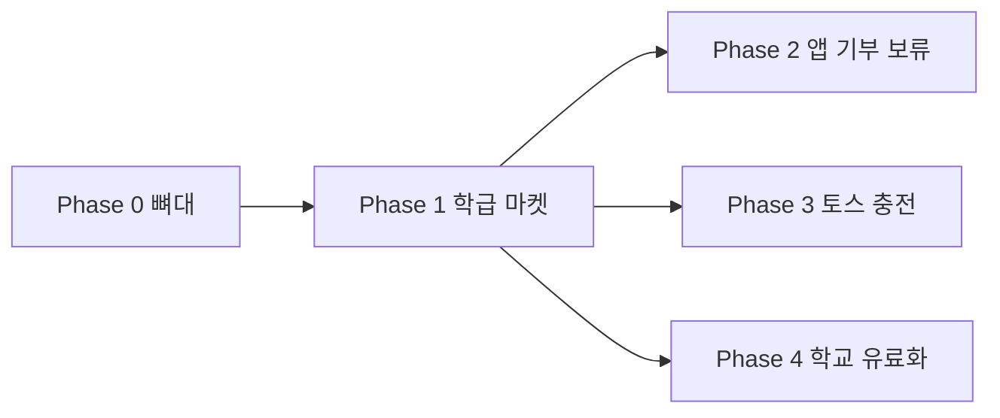

# 로드맵

## 프로젝트 비전

관심 떨어진 굿즈를 기부한 학생에게 포인트를 주고, 일반 쇼핑몰처럼 정리된 상품을 포인트로 구매하게 한다.  
1차 대상은 **1·2·3학년 전교**, 수업 약 30명 × **전교 18반** (약 540명)이다.

---

## Phase 개요

| Phase | 이름 | 목표 | 상태 |
|-------|------|------|------|
| **0** | 뼈대 | Next.js + shadcn 프로젝트 생성 | ✅ |
| **1** | 학급 마켓 MVP | 학번 로그인, 몰, 마이페이지, 관리자 상품·포인트 | 📋 |
| **2** | 앱 기부 신청 | 1차에 없음. 실물 전달로 대체. 재검토 시에만 | ⏸️ |
| **3** | 포인트 충전 | 토스페이먼츠, 학생 수수료 0, PG 흡수 | 🔮 |
| **4** | 학교 구독 | 파일럿 후 학교 단위 유료화 | 🔮 |

---

## Phase 0 — 뼈대

**완료 항목**

- Next.js 16.3.3 App Router, TypeScript, Tailwind 4, ESLint, `src/`, `@/*`
- shadcn/ui + Lucide, `src/components/ui/button.tsx`

**기술 스택:** Next.js + Supabase + Tailwind + shadcn/ui  
**비고:** 기능 화면은 기본 스타터 페이지만 존재. Supabase 연동은 아직 없음.

---

## Phase 1 — 학급 마켓 MVP

**목표:** 전교 명단(CSV)의 학생이 학번으로 들어와 굿즈를 보고 포인트로 사고, 관리자 학번은 상품을 올리고 포인트를 지급한다.

**범위 (In):**

- CSV 명단 일괄 등록 (학번, 이름, 학년, 반, 번호, role)
- 학번 로그인 (`20101` = 2학년 1반 1번, 1·3학년도 `10101`/`30101`) → 이름 확인 → 비밀번호 설정
- 비밀번호 찾기: 학번 + 이름 확인 후 새 비밀번호
- 공개 회원가입 없음
- 상품 목록·상세 (사진, 컨디션, 판매 상태, 필요 포인트, 수량, 카테고리)
- 찜하기
- 포인트로 구매 (잔액·수량 차감, 동시 구매는 선점만 성공)
- 수령 전 구매 취소 → 포인트 환급, 재고 복구. 실물은 교실/선생님 수령
- 마이페이지: 포인트, 구매 목록, 찜 목록
- 관리자(`role=admin` 학번): 상품 업로드·수정, 개별 포인트 지급, 행사 일괄 지급

**비범위 (Out):**

- 공개 회원가입, 이메일 관리자 계정
- 학생용 기부 신청 화면 (실물 전달로 대체)
- 토스 충전 (Phase 3)
- 타 학교·구독 유료화 (Phase 4)
- 검색·리뷰·채팅·대기열·관리자 비밀번호 초기화

**완료 기준:**

- [ ] CSV에 있는 학번만 로그인된다
- [ ] 첫 로그인 시 이름이 맞고, 비밀번호를 직접 정할 수 있다
- [ ] 학번+이름으로 비밀번호를 다시 정할 수 있다
- [ ] 학생이 상품을 보고 찜하고, 포인트가 충분하면 구매된다
- [ ] 동시에 누르면 한 명만 사고 나머지는 품절이다
- [ ] 수령 전 취소 시 포인트와 재고가 돌아온다
- [ ] 마이페이지에서 포인트·구매·찜이 보인다
- [ ] 관리자 학번만 상품 등록·포인트 지급(개별+일괄)을 할 수 있다
- [ ] 회원가입 화면이 없다

**PRD:**

- [prd/001-student-login.md](./prd/001-student-login.md)
- [prd/002-shop-catalog.md](./prd/002-shop-catalog.md)
- [prd/003-mypage.md](./prd/003-mypage.md)
- [prd/004-admin-products.md](./prd/004-admin-products.md)

**권장 구현 순서 (티켓 단위):**

1. `feat/p1-1-student-login` — CSV 명단 + 학번 로그인 + 비밀번호 찾기
2. `feat/p1-2-admin-products` — 관리자 상품 업로드·포인트 지급
3. `feat/p1-3-shop-catalog` — 목록·상세·찜·구매(선점)
4. `feat/p1-4-mypage` — 마이페이지 + 수령 전 취소

---

## Phase 2 — 앱 기부 신청 (보류)

**목표:** Q1에서 **실물 전달 + 관리자 수동 지급**으로 정했으므로, 학생용 기부 신청 화면은 만들지 않는다.

핵심 루프는 Phase 1에서 이렇게 돈다: 학생 → 선생님에게 물건 전달 → 관리자가 상품 등록 + 포인트 지급 → 학생이 몰에서 교환.

**재검토 조건:** 나중에 앱에서 기부 신청이 필요해지면 [prd/005-donation-points.md](./prd/005-donation-points.md)를 연다.

---

## Phase 3 — 토스 포인트 충전

**목표:** 토스페이먼츠로 충전. 학생에게 플랫폼 수수료 없음. **PG 수수료는 우리가 흡수.**

**비범위 (Out):** 다른 PG, 구독, 환산 비율은 착수 시 확정

**완료 기준:**

- [ ] 학생이 토스로 충전하면 포인트가 오른다
- [ ] 학생 화면에 마켓 수수료가 없다
- [ ] 충전 최소 금액·1원당 포인트는 착수 시 정한다

---

## Phase 4 — 학교 행사 유료화

**목표:** 지금은 **우리 학교 파일럿**. 이후 학교 단위 **구독**으로 다른 학교 선생님에게 판다.

**비범위 (Out):** 1차 멀티테넌시 없음. 행사 건당 과금은 채택하지 않음.

---

## 의존 관계

Phase 2·3·4는 Phase 1 이후에 착수한다. 2와 3은 서로 독립적으로 진행할 수 있다.

---

## 우선순위 원칙

1. **Taipa** — 시간 대비 효과. 학급 540명이 바로 쓰는 로그인·상품·구매를 먼저.
2. **Ticket 단위** — Phase 전체를 한 번에 구현하지 않는다.
3. **기존 코드 존중** — 명시적 요청 없이 rollback 금지.
