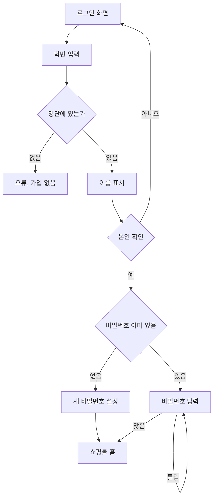
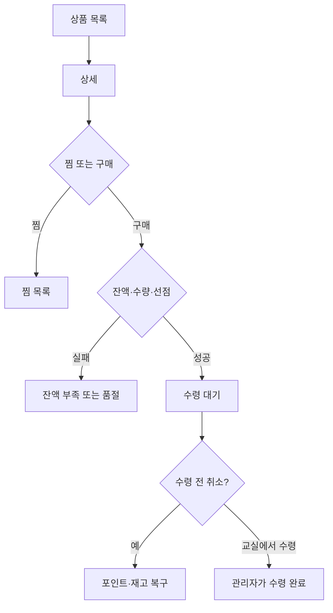
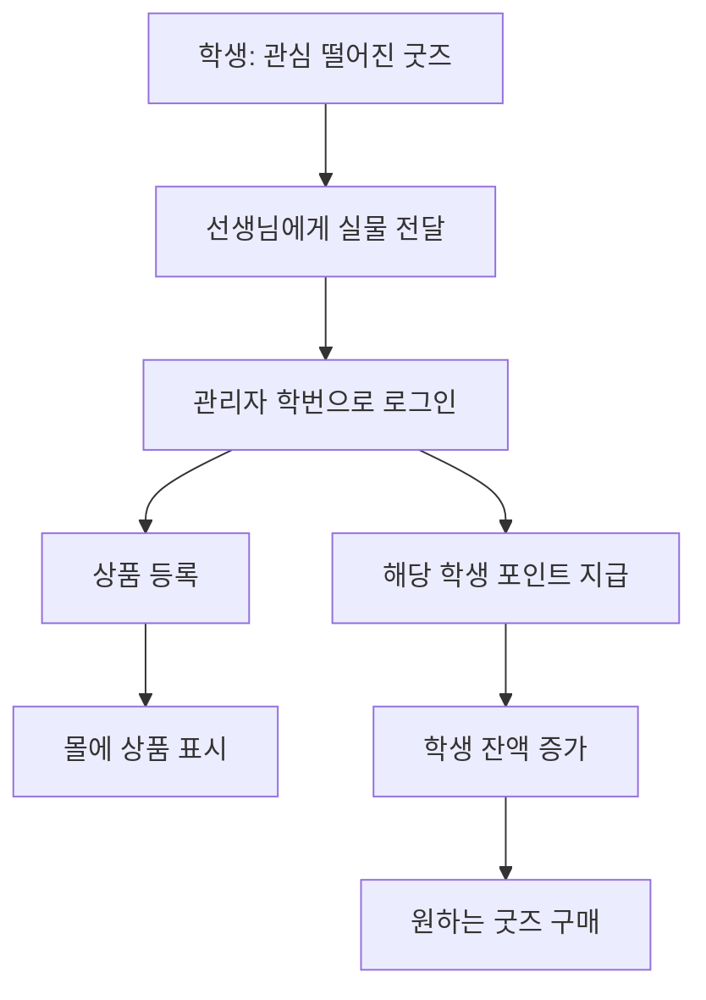

# 사용자 흐름 (User Flows)

> **양파**

---

## 1. 첫 로그인 (비밀번호 설정)



학번 5자리: 학년 + 반 2자리 + 번호 2자리. 찾기: 학번 → 이름 확인 → 새 비밀번호.

---

## 2. 포인트로 굿즈 구매 · 수령 전 취소



동시에 누르면 먼저 성공한 사람만 사고 나머지는 품절이다.

---

## 3. 실물 기부 → 관리자 등록 (Q1)



앱 기부 신청서는 없다. 행사 때는 여러 명에게 포인트를 한 번에 줄 수 있다.

---

## 4. 관리자 상품 업로드

```mermaid
flowchart TD
    A[학번 로그인 role=admin] --> B[/admin]
    B --> C[새 상품]
    C --> D[사진 / 컨디션 / 판매상태 / 포인트 / 수량 / 카테고리]
    D --> E[학생 몰 노출]
```

---

## 역할별 접근

| 기능 | 비로그인 | 학생 | 관리자 학번 |
|------|----------|------|-------------|
| 학번 로그인 | O | - | 같은 화면 |
| 회원가입 | X | X | X |
| 몰·찜·구매 | X | O | O |
| 수령 전 취소 | X | 본인 주문 | - |
| 상품 업로드 | X | X | O |
| 포인트 개별/일괄 | X | X | O |
| CSV 명단 | X | X | O |
| 수령 완료 처리 | X | X | O |
| 앱 기부 신청 | X | X | X |
